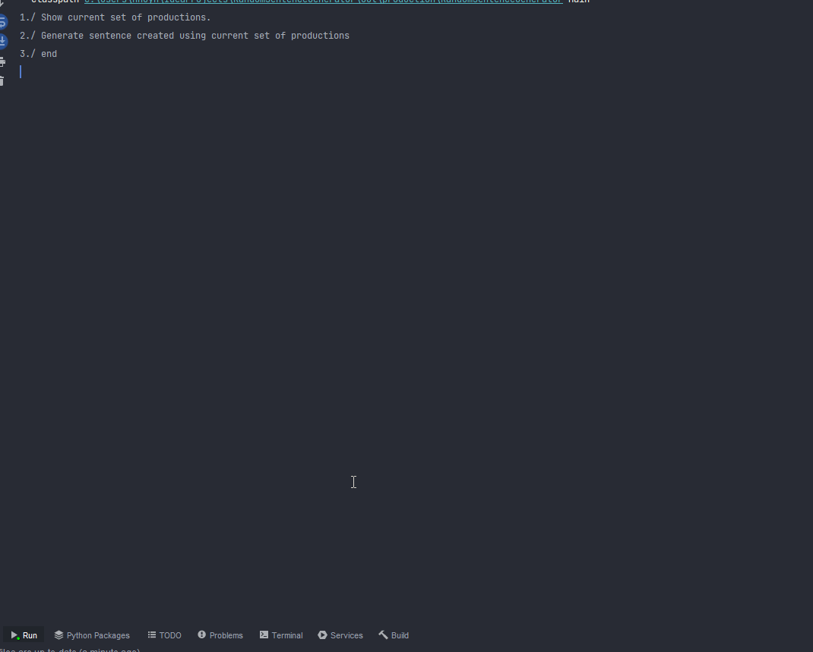

# About
This is a fun project to demonstrate how we can create a CFG using <b>recursion</b>
# How does it work?
We always start with production rule that contains variable S. We keep adding text 
 
of this production rule to our result until we encounter a variable. We then 
pick a production rule that has this variable and <b>recursively</b> explores it. We
stop once there is no more production rule to explore. 
### Example
Let's say we have the following set of production rules:
 
<b>&lt;S&gt; = I am &lt;a&gt; happy
 
&lt;a&gt; = very</b>
 
In the above example, we have two variables S and a and two production rules that are associated with
 
these variables. We start with S. We keep adding text of this production rule until we
 
encounter variable. Then we explore production rule that starts with a. After
adding all text of this production rule to our string variable, we don't have any variable
left, so we backtrack to the production rule that we were working on previously which was
S. we then add happy to our string variable and return it. As a result, we have I am very happy.

# Screenshot:

